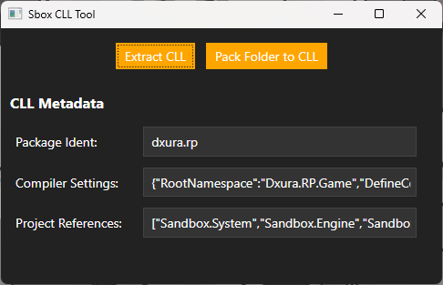

# S&Box .CLL GUI Unpacker/Packer

Based on https://github.com/chrisspieler/sbox-cll-extractor

You can also open the cll file with SboxCllGui.exe directly and it will unpack it in the same folder without opening gui

